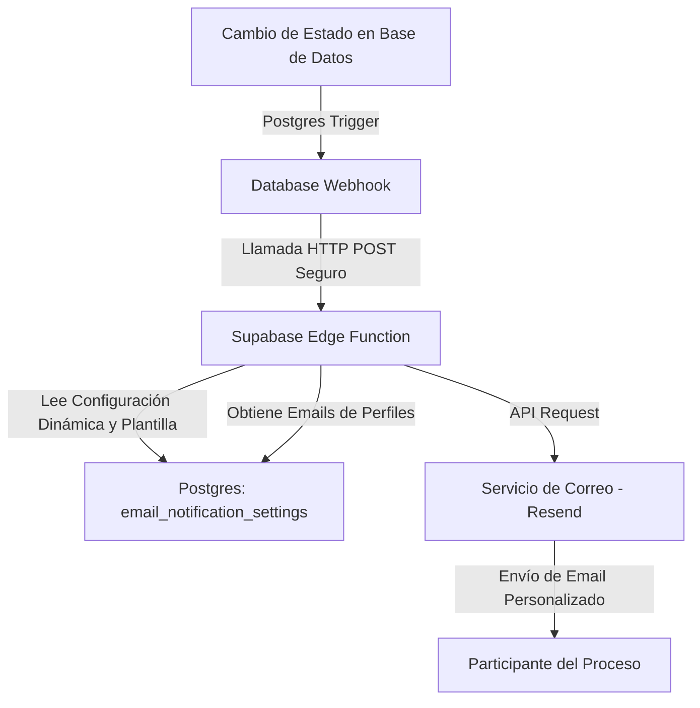

# Plan de Implementación: Alertas y Notificaciones por Correo Electrónico

Este documento evalúa la factibilidad técnica y detalla el diseño de arquitectura, flujos, plantillas y código necesario para implementar alertas automáticas y personalizadas por correo electrónico en la plataforma **gauge-wise-flows**, incluyendo un panel de administración en el menú **Configuración**.

---

## 1. Evaluación de Factibilidad Técnica

La implementación es **100% factible** utilizando la infraestructura actual basada en **Supabase** y la base de datos PostgreSQL. 

### Componentes Tecnológicos Propuestos
1. **Proveedor de Correo (Mailing Provider)**: Se propone integrar **Resend** (recomendado por Supabase por su API moderna y excelente entregabilidad) o cualquier servidor **SMTP corporativo**. Resend ofrece un plan gratuito generoso (3,000 correos/mes) ideal para el desarrollo y puesta en marcha.
2. **Supabase Edge Functions**: Funciones TypeScript en el motor Deno para procesar los envíos de correo de manera asíncrona mediante APIs REST seguras.
3. **Database Webhooks / Triggers**: Disparadores en PostgreSQL que detectan cambios de estado en la tabla `indicator_reports` y notifican instantáneamente a la Edge Function mediante Webhooks HTTP.
4. **Panel de Gestión (Admin UI)**: Una sección interactiva en el menú **Configuración** de la plataforma que permite activar/desactivar notificaciones, editar las plantillas de correo y configurar destinatarios adicionales en copia (CC).



---

## 2. Etapas, Destinatarios y Reglas de Negocio

El sistema enviará notificaciones específicas dependiendo del estado del reporte e identificará automáticamente a los destinatarios consultando las tablas `instrument_indicators`, `profiles` y `user_institutions` (para relacionar a la **Jefatura** con el Centro de Responsabilidad del informante asignado).

| Evento / Cambio de Estado | Activador (Trigger) | Emisor | Destinatario | Propósito / Mensaje |
| :--- | :--- | :--- | :--- | :--- |
| **Inicio de Período** | Apertura/activación de un nuevo `period` (`status` pasa a `open`) | Sistema (Admin) | **Informante, Revisor y Jefatura** | Avisar que comenzó un período de reportabilidad de indicadores y que deben ingresar/revisar avances. |
| **Reporte Enviado** | `indicator_reports.status` pasa a `submitted` | Informante | **Revisor y Jefatura** | Notificar al revisor asignado que tiene un indicador pendiente de aprobación y opcionalmente a las jefaturas del área. |
| **Reporte Devuelto** | `indicator_reports.status` pasa a `returned` | Revisor | **Informante y Jefatura** | Notificar al informante que su reporte fue rechazado/devuelto y requiere correcciones, y opcionalmente a la jefatura de su área. |
| **Reporte Aprobado** | `indicator_reports.status` pasa a `approved` | Revisor | **Informante, Revisor y Jefatura** | Notificar al informante y jefatura del cumplimiento exitoso de la meta para ese período. |

> [!NOTE]
> **Relación de Jefaturas**: Cuando se selecciona notificar al rol `Jefatura`, el sistema identifica el Centro de Responsabilidad (`institution_id`) del **Informante Asignado** al indicador. Luego, consulta la tabla `user_institutions` para encontrar a todos los usuarios con rol `'jefatura'` asociados a dicho Centro de Responsabilidad y enviarles su respectiva notificación personalizada.

---

## 3. Estructura de Datos para Configuración (SQL)

Para permitir que el administrador configure las alertas y destinatarios dinámicamente, crearemos una tabla `email_notification_settings`:

```sql
-- Tabla para almacenar la configuración de las notificaciones
CREATE TABLE public.email_notification_settings (
  id UUID PRIMARY KEY DEFAULT gen_random_uuid(),
  event_type VARCHAR(50) UNIQUE NOT NULL, -- 'period_started', 'report_submitted', 'report_returned', 'report_approved'
  display_name VARCHAR(100) NOT NULL,    -- Nombre amigable para la interfaz
  description TEXT,                       -- Explicación del trigger
  is_enabled BOOLEAN DEFAULT true,        -- Activar/desactivar la alerta
  subject_template TEXT NOT NULL,         -- Plantilla del asunto del correo
  body_template TEXT NOT NULL,            -- Plantilla del cuerpo en HTML/Texto
  notify_roles VARCHAR(50)[] DEFAULT '{}', -- Roles predeterminados a notificar (informant, reviewer, jefatura)
  custom_cc TEXT[],                       -- Correos adicionales fijos en copia (ej. administradores)
  updated_at TIMESTAMP WITH TIME ZONE DEFAULT timezone('utc'::text, now()) NOT NULL
);

-- Insertar configuraciones iniciales por defecto
INSERT INTO public.email_notification_settings (event_type, display_name, description, subject_template, body_template, notify_roles)
VALUES 
('period_started', 'Inicio Periodo de Reportabilidad Indicadores', 'Se envía a los informantes, revisores y jefaturas al dar inicio a un nuevo período de reportabilidad.', '[Nuevo Periodo] Inicio de reportabilidad para: {{period_name}}', 'Estimado/a {{recipient_name}},\n\nLe informamos que ha iniciado el periodo de reportabilidad para {{period_name}}.\n\nPor favor, recuerde ingresar o revisar los avances correspondientes.', ARRAY['informant', 'reviewer']),
('report_submitted', 'Reporte Enviado para Revisión', 'Se envía al revisor asignado cuando el informante sube un avance.', '[Revisión Pendiente] Nuevo reporte enviado: {{indicator_name}}', 'El informante {{informant_name}} ha reportado un avance para el indicador {{indicator_name}} del instrumento {{instrument_name}} durante el período {{period_name}}.', ARRAY['reviewer']),
('report_returned', 'Reporte Devuelto con Observaciones', 'Se envía al informante cuando el revisor solicita correcciones.', '[Observación / Devolución] Reporte devuelto: {{indicator_name}}', 'El revisor {{reviewer_name}} ha devuelto el reporte con observaciones para el indicador {{indicator_name}}.', ARRAY['informant']),
('report_approved', 'Reporte Aprobado / Cumplido', 'Se envía al informante cuando el revisor valida el avance.', '[Aprobado] Reporte validado: {{indicator_name}}', 'Excelente. El avance para el indicador {{indicator_name}} ha sido aprobado.', ARRAY['informant']);
```

---

## 4. Interfaz de Administración ("Configuración > Alertas")

Se diseñará una pestaña dentro del módulo de **Configuración** exclusiva para administradores.

### Componentes de la Interfaz
1. **Selector de Alertas**: Un menú o acordeón para editar cada uno de los eventos definidos (`report_submitted`, `report_returned`, `report_approved`).
2. **Switch de Habilitación**: Control deslizante (Switch) para encender o apagar la alerta por completo.
3. **Destinatarios Predeterminados**: Checkboxes para definir qué roles del proceso reciben la alerta (`Informante`, `Revisor`).
4. **Copia Adicional (CC)**: Input de etiquetas (Tag Input) para ingresar correos electrónicos adicionales que recibirán copia de la alerta (por ejemplo, correos de control de calidad o jefaturas generales).
5. **Editor de Plantilla**: Inputs para personalizar el **Asunto** y el **Mensaje**. Se habilitará un panel lateral con placeholders disponibles para arrastrar o hacer clic (ej: `{{indicator_name}}`, `{{period_name}}`, `{{reported_value}}`).

```
+-------------------------------------------------------------------------+
| CONFIGURACIÓN > ALERTAS Y NOTIFICACIONES                                |
+-------------------------------------------------------------------------+
| [ Alerta: Reporte Devuelto con Observaciones ] [ Switch: [ON] ]         |
|                                                                         |
| Destinatarios: [x] Informante Asignado  [ ] Revisor Asignado            |
| Enviar copia a (CC): [ add email + ] (ej. central@correo.cl)            |
|                                                                         |
| Asunto del Correo:                                                      |
| [ [Observación / Devolución] Reporte devuelto: {{indicator_name}}     ] |
|                                                                         |
| Mensaje (Cuerpo del Correo):                                            |
| +---------------------------------------------------------------------+ |
| | Estimado/a {{recipient_name}},                                      | |
| | El revisor {{reviewer_name}} ha devuelto el reporte del indicador   | |
| | {{indicator_name}} correspondente al período {{period_name}}.       | |
| | Observación: {{comments}}                                           | |
| +---------------------------------------------------------------------+ |
| Placeholders disponibles:                                               |
|  {indicator_name}  {period_name}  {comments}  {reported_value}          |
|                                                                         |
| [ Guardar Configuración ]                                               |
+-------------------------------------------------------------------------+
```

---

## 5. Código Técnico y Ejecución

### A. Postgres Trigger (Supabase DDL)

Este disparador envía el evento de actualización a la Edge Function.

```sql
CREATE OR REPLACE FUNCTION public.handle_indicator_report_notification()
RETURNS TRIGGER AS $$
DECLARE
  payload jsonb;
BEGIN
  payload := jsonb_build_object(
    'event_type', 'report_' || NEW.status, -- 'report_submitted', 'report_returned', 'report_approved'
    'report_id', NEW.id,
    'status', NEW.status,
    'old_status', CASE WHEN TG_OP = 'UPDATE' THEN OLD.status ELSE NULL END
  );

  PERFORM net.http_post(
    url := 'https://ewwzmcsxfugqfujvbyxo.supabase.co/functions/v1/send-notification',
    headers := jsonb_build_object(
      'Content-Type', 'application/json',
      'Authorization', 'Bearer ' || current_setting('app.settings.service_role_key', true)
    ),
    body := payload
  );

  RETURN NEW;
END;
$$ LANGUAGE plpgsql SECURITY DEFINER;
```

### B. Código de la Edge Function Integrando Plantillas Dinámicas

La Edge Function ahora lee las plantillas directamente desde la base de datos `email_notification_settings` y las reemplaza en caliente antes de enviar mediante **Resend**.

```typescript
import { serve } from "https://deno.land/std@0.168.0/http/server.ts"
import { createClient } from "https://esm.sh/@supabase/supabase-js@2.39.8"

const RESEND_API_KEY = Deno.env.get('RESEND_API_KEY')
const SUPABASE_URL = Deno.env.get('SUPABASE_URL')
const SUPABASE_SERVICE_ROLE_KEY = Deno.env.get('SUPABASE_SERVICE_ROLE_KEY')

serve(async (req) => {
  try {
    const { report_id, status, event_type, old_status } = await req.json()

    // Evitar disparos redundantes si el estado no cambió
    if (old_status && old_status === status) {
      return new Response(JSON.stringify({ message: 'No status change' }), { status: 200 })
    }

    const supabase = createClient(SUPABASE_URL!, SUPABASE_SERVICE_ROLE_KEY!)

    // 1. Cargar la configuración dinámica definida por el administrador
    const { data: config, error: configError } = await supabase
      .from('email_notification_settings')
      .select('*')
      .eq('event_type', event_type)
      .single()

    if (configError || !config) {
      return new Response(JSON.stringify({ message: `No active config found for ${event_type}` }), { status: 200 })
    }

    if (!config.is_enabled) {
      return new Response(JSON.stringify({ message: `Notification ${event_type} is disabled by admin` }), { status: 200 })
    }

    // 2. Obtener los datos del reporte, indicador, instrumento e involucrados
    const { data: report, error } = await supabase
      .from('indicator_reports')
      .select(`
        id,
        reported_value,
        numerator,
        denominator,
        comment,
        status,
        indicators (
          id,
          name,
          unit
        ),
        periods (
          name
        ),
        profiles!indicator_reports_created_by_fkey (
          name,
          email
        )
      `)
      .eq('id', report_id)
      .single()

    if (error || !report) throw new Error(`Report not found`)

    const { data: instInd } = await supabase
      .from('instrument_indicators')
      .select(`
        informant:profiles!instrument_indicators_informant_id_fkey (name, email),
        reviewer:profiles!instrument_indicators_reviewer_id_fkey (name, email),
        instrument:instruments (name)
      `)
      .eq('indicator_id', (report as any).indicators.id)
      .single()

    const informant = (instInd as any).informant
    const reviewer = (instInd as any).reviewer
    const instrumentName = (instInd as any).instrument.name

    // 3. Resolver destinatarios basados en la configuración de roles
    const recipients: string[] = []
    let recipientName = ""

    if (config.notify_roles.includes('informant') && informant?.email) {
      recipients.push(informant.email)
      recipientName = informant.name
    }
    if (config.notify_roles.includes('reviewer') && reviewer?.email) {
      recipients.push(reviewer.email)
      if (!recipientName) recipientName = reviewer.name
    }

    if (recipients.length === 0) {
      return new Response(JSON.stringify({ message: 'No active recipients' }), { status: 200 })
    }

    // 4. Reemplazar los marcadores de posición (placeholders) en el asunto y cuerpo
    const placeholders = {
      '{{recipient_name}}': recipientName,
      '{{indicator_name}}': report.indicators.name,
      '{{instrument_name}}': instrumentName,
      '{{period_name}}': report.periods.name,
      '{{reported_value}}': `${report.reported_value} ${report.indicators.unit}`,
      '{{comments}}': report.comment || 'Sin comentarios adicionales',
      '{{reviewer_name}}': reviewer?.name || 'Revisor Asignado',
      '{{informant_name}}': informant?.name || 'Informante Asignado'
    }

    let subject = config.subject_template
    let body = config.body_template

    for (const [key, value] of Object.entries(placeholders)) {
      subject = subject.replaceAll(key, value)
      body = body.replaceAll(key, value)
    }

    // 5. Envoltura HTML premium común
    const finalHtml = `
      <!DOCTYPE html>
      <html>
      <head>
        <meta charset="utf-8">
        <style>
          body { font-family: sans-serif; background-color: #f8fafc; color: #1e293b; padding: 20px; }
          .card { max-width: 600px; margin: 0 auto; background: #ffffff; border-radius: 12px; border: 1px solid #e2e8f0; overflow: hidden; box-shadow: 0 4px 6px rgba(0,0,0,0.05); }
          .header { background: #0f172a; padding: 24px; text-align: center; color: #ffffff; }
          .content { padding: 24px; }
          .text-content { line-height: 1.6; margin-bottom: 24px; white-space: pre-line; }
          .btn { display: inline-block; background: #2563eb; color: #ffffff !important; text-decoration: none; padding: 12px 24px; font-weight: bold; border-radius: 6px; font-size: 14px; }
        </style>
      </head>
      <body>
        <div class="card">
          <div class="header"><h2>Plataforma de Indicadores AGE</h2></div>
          <div class="content">
            <div class="text-content">${body}</div>
            <div style="text-align: center;">
              <a href="https://gauge-wise-flows.pages.dev" class="btn">Ir al Portal</a>
            </div>
          </div>
        </div>
      </body>
      </html>
    `

    // Enviar correo
    const emailPayload: any = {
      from: 'Monitoreo AGE <onboarding@resend.dev>',
      to: recipients,
      subject: subject,
      html: finalHtml
    }

    // Agregar copia oculta o CC si fue configurado por el administrador
    if (config.custom_cc && config.custom_cc.length > 0) {
      emailPayload.cc = config.custom_cc
    }

    const res = await fetch('https://api.resend.com/emails', {
      method: 'POST',
      headers: {
        'Content-Type': 'application/json',
        'Authorization': `Bearer ${RESEND_API_KEY}`
      },
      body: JSON.stringify(emailPayload)
    })

    const resData = await res.json()
    return new Response(JSON.stringify(resData), { status: 200 })

  } catch (err: any) {
    return new Response(JSON.stringify({ error: err.message }), { status: 500 })
  }
})
```
